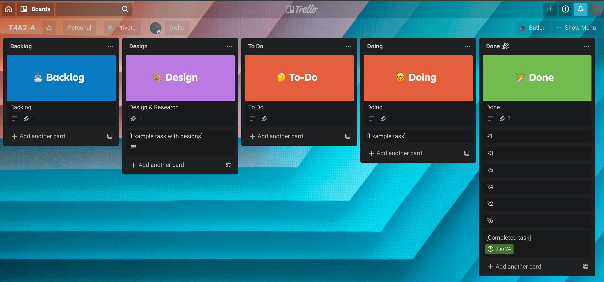

# T4A2-A

## Description

### Purpose

The purpose of this project, is to provide the user with a German word upon visiting the page, the word will provided alongside other details such as the definition, pronunciation, and English equivalent.

The user can then choose to save the word to their 'dictionary', which will allow them to revisit the word at a later time. 

### Functionality/Features

- Display a word upon visiting page/clicking 'New Word' button.

  Result includes:

  - Pronunciation
  - Definition
  - English translation

- Save a word to 'dictionary'

  - Revisit the word at a later time
  - Drill all words in dictionary
  - Saved to each user

- Login to access dictionary and features

### Target Audience

The target audience for this project is any English speakers who would like to improve their vocabulary and/or understanding of German words, in a way that is less studious than reading textbooks for hours, but rather could add a word a day to someone's vocabulary by simply visiting the page.

It is likely that companies or educational facilities would adopt this project as a free, open-source method of improving language skills, for employees, or for students.

### Tech Stack

- Node
  - Express
  - React
- MongoDB

## Dataflow Diagram

## Application Architecture Diagram

## User Stories

| Story                                                        | Implementation                                               |
| ------------------------------------------------------------ | ------------------------------------------------------------ |
| As a German learner, I want to learn a new word everyday, so that I can improve my vocabulary. | Index page, word generation, translation, definition and pronunciation. |
| As a teacher, I want my students to improve their vocabulary and understanding of the German language by reinforcing their knowledge of specific words they've chosen to learn, so that they can do better in class reading tasks. | Dictionary save feature.                                     |
| As a user, I want to log in and view my saved words, so that I can practice them. | Login and dictionary pages.                                  |

## Wireframes

### Index Page Wireframe

### Login Page Wireframe

### Dictionary Page Wireframe

## Trello Board

Here's what my Trello board looked like before starting the project, it's set out in an agile style.

Here's what the board looked like a bit later on in the project.

Here's what my board looks like at the end of the project

